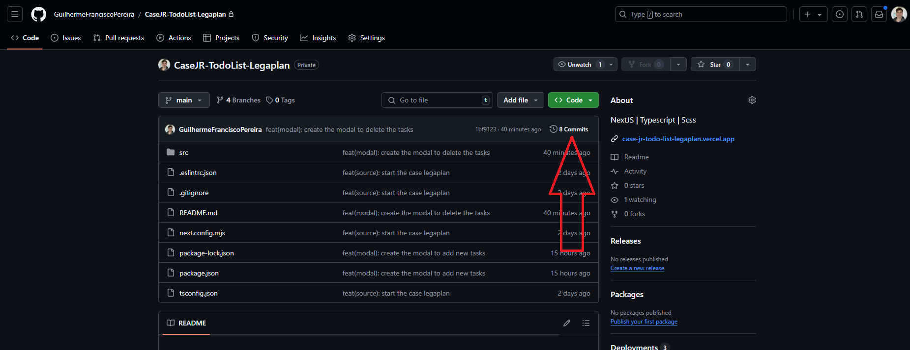
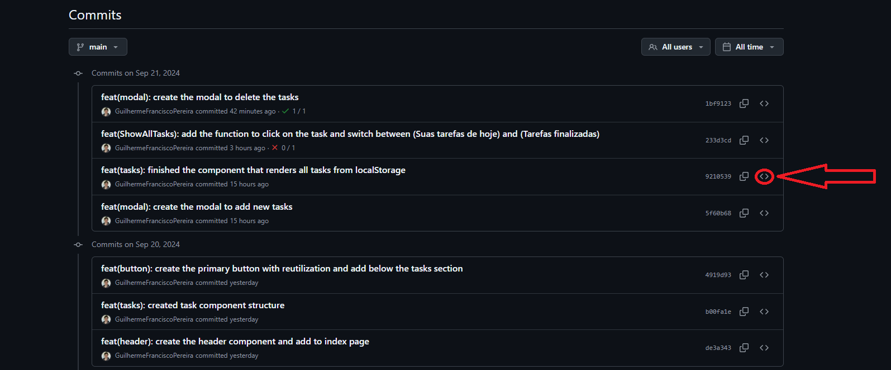
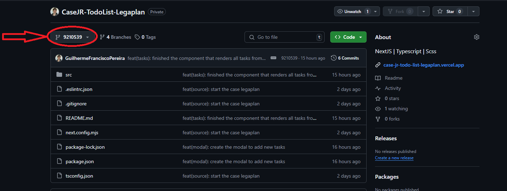

<p align="left">
  <a href="./README.md">
    
  </a>
</p>

#   Junior Dev Challenge - TodoList - Legaplan 

## 📌 About the Challenge:

### This project is a challenge proposed by the LegaPlan team for a Junior Developer position. The key points are:
- The project must be built using NextJS with App Router and SCSS
- Beyond good coding practices, maximum design fidelity is expected. Pay attention to details such as shadows, gradients, and more.

##

> 🔗 Website Link: <a href="https://case-jr-todo-list-legaplan.vercel.app" target="_blank">https://case-jr-todo-list-legaplan.vercel.app</a>

# 

## 🖥️ First version of the site - (PC):


## 📱 First version of the site - (Mobile):


## 💭 How LocalStorage looks:


##

#

## 🖥 Technologies Used
<div align='center'>


</div>

    - Next
    - React
        - React-query
    - Typescript
    - Scss

## Used versions:
    - Next: 14.2.12
    - React: 18
        - React-query: 3.39.3
    - Typescript: 5
    - Scss: 1.79.1

## 🙋🏻‍♂ How to navigate the project?

### All source code files are located in: `./src`

## 🛈 Project structure

- `./src/app:` This project uses App Router, but there are no additional routes. Here you’ll find the index page and the layout with global config and the favicon.

- `./src/assets:` All project images are stored here.

- `./src/components:` Reusable components used throughout the project. In this first version, we have:
    - Button: Buttons
    - Header
    - LocalStorage: Renders all stored tasks
    - Modal: Both modals
    - Tasks: Wraps and renders everything on the Page

- `./src/contexts:` Shared application-wide data. In this version, it includes Modal contexts (folder: Modals).
    - Note: The `AppProvider.tsx` file groups all providers and exports them as one.

- `./src/hooks:` Custom hooks containing the app’s logic.

- `./src/services:` Contains service functionalities. In this version, only one file `QueryClient.ts` is used to create and export the QueryClient provider directly (using 'use client').

- `./src/styles:` Contains styling files. In this version, a single file `GlobalStyles.scss` contains global styles.

## ❔ How to run the project on your machine?

- Although the live link is at the top, feel free to run the code locally! Here's how:

- First, you need Git installed on your computer.
    - Windows: Download Git <a href="https://git-scm.com/download/win" target="_blank">here</a> and follow the installation steps.
    - macOS: Download <a href="https://git-scm.com/download/mac" target="_blank">here</a> or use Homebrew:
        ```bash
        brew install git
        ```
    - Linux: Use your distro’s package manager (e.g., for Debian/Ubuntu):
        ```bash
        sudo apt install git
        ```

- Open the terminal (Git Bash on Windows is fine)

- Navigate to the folder where you want to store the project

- Clone the repository:
    ```bash
    git clone https://github.com/GuilhermeFranciscoPereira/CaseJR-TodoList-Legaplan.git
    ```

- Enter the project folder:
    ```bash
    cd CaseJR-TodoList-Legaplan
    ```

- Open the project in your preferred editor. Example with VSCode:
    ```bash
    code .
    ```

- 🚨 Important! To avoid code errors after cloning, run:
    ```bash
    npm i
    ```

- To run the project locally:
    ```bash
    npm run dev
    ```

## ⚠ Important project notes ⚠

### Each commit includes a detailed README describing the changes. Some also include screenshots of the website at that moment — feel free to browse the commits and see the creation process!

### How to do that?

To explore the creation process and track changes:

#### First: Scroll up on this page until you find the area under the green button that looks like the image below, then click on it.


#### Second: On the right side of the commits, click the `<>` icon as shown in the image to view the code and detailed README from that time.


#### Third: To return here, click the location shown in the image below:


#### Then click `main` to return to this version!

##

## 🎉 That’s it! This was the challenge. If you have any questions or want to give feedback, feel free to reach out on LinkedIn:

> My LinkedIn: <a href="https://www.linkedin.com/in/guilherme-francisco-pereira-4a3867283" target="_blank">https://www.linkedin.com/in/guilherme-francisco-pereira-4a3867283</a>

### 🚀 Thanks for checking this out! I hope you liked it. Why not check out my other repositories now? 👋🏻

#

### ❤️ Credits:

- #### Full Figma design credits to the LegaPlan team:
> <a href="https://www.figma.com/design/4iESWnasLZSHyghg1ipj1P/Teste-Dev-Junior---Legaplan?node-id=0-1&node-type=canvas&t=GxQUSS4KxQUWBUBN-0" target="_blank">Figma Link</a>

- #### Emoji credits:
> <a href="https://emojipedia.org" target="_blank">https://emojipedia.org</a>

- #### Badge credits:
> <a href="https://shields.io" target="_blank">https://shields.io</a>
